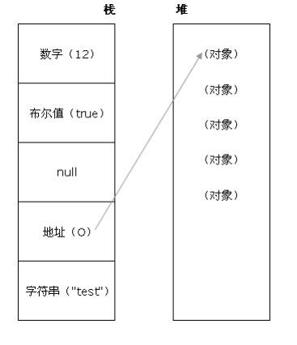

# JavaScript

## 说说你对作⽤域链的理解

- 作⽤域链的作⽤是保证执⾏环境⾥有权访问的变量和函数是有序的，作⽤域链的变量只能向上访问，变量访问到 **window** 对象即被终⽌，作⽤域链向下访问变量是不被允许的
- 简单的说，作⽤域就是变量与函数的可访问范围，即作⽤域控制着变量与函数的可⻅性和⽣命周期

## JavaScript原型，原型链 ? 有什么特点？
- 每个对象都会在其内部初始化⼀个属性，就是 **prototype** (原型)，当我们访问⼀个对象的属性时
- 如果这个对象内部不存在这个属性，那么他就会去 **prototype** ⾥找这个属性，这个 **prototype** ⼜会有⾃⼰的 **prototype** ，于是就这样⼀直找下去，也就是我们平时所说的原型链的概念
-  关系： `instance.constructor.prototype = instance.__proto__`
- 特点：
    - **JavaScript** 对象是通过引⽤来传递的，我们创建的每个新对象实体中并没有⼀份属于⾃⼰的原型副本。当我们修改原型时，与之相关的对象也会继承这⼀改变
- 当我们需要⼀个属性的时， **Javascript** 引擎会先看当前对象中是否有这个属性， 如果没有的

- 就会查找他的**Prototype** 对象是否有这个属性，如此递推下去，⼀直检索到 **Object** 内建对象

## 请解释什么是事件代理

- 事件代理（ **Event Delegation** ），⼜称之为**事件委托**。是 JavaScript 中常⽤绑定事件的常⽤技巧。顾名思义，“事件代理”即是**把原本需要绑定的事件委托给⽗元素，让⽗元素担当事件监听的职务**。
- 事件代理的原理是DOM元素的**事件冒泡**。使⽤事件代理的好处是可以提⾼性能
- 可以⼤量节省内存占⽤，**减少事件注册**，⽐如在 table 上代理所有 td 的 click 事件就⾮常棒
- 可以实现当新增⼦对象时⽆需再次对其绑定


## 事件模型

:::tip 事件模型
W3C 中定义事件的发⽣经历三个阶段：**捕获阶段（ capturing ）**、**⽬标阶段**
（ targetin ）、**冒泡阶段（ bubbling ）**
:::
- 冒泡型事件：当你使⽤事件冒泡时，⼦级元素先触发，⽗级元素后触发
- 捕获型事件：当你使⽤事件捕获时，⽗级元素先触发，⼦级元素后触发
- **DOM** 事件流：同时⽀持两种事件模型：捕获型事件和冒泡型事件
- 阻⽌冒泡：在 W3c 中，使⽤ **stopPropagation()** ⽅法；在IE下设置 cancelBubble =true
- 阻⽌捕获：阻⽌事件的默认⾏为，例如 click - `<a> `后的跳转。在 W3c 中，使⽤ **stopPropagation()** ⽅法，在 IE 下设置 window.event.returnValue = false
:::demo 事件模型
js/eventModal
:::

## new操作符具体⼲了什么呢?

- 创建⼀个空对象，并且 **this** 变量引⽤该对象，同时还继承了该函数的原型
- 属性和⽅法被加⼊到 **this** 引⽤的对象中
- 新创建的对象由 **this** 所引⽤，并且最后隐式的返回 **this**

## Ajax原理
- Ajax 的原理简单来说是在⽤户和服务器之间加了—个中间层( **AJAX** 引擎)，通过 **XmlHttpRequest** 对象来向服务器发异步请求，从服务器获得数据，然后⽤ **javascript** 来操作 **DOM** ⽽更新⻚⾯。使⽤户操作与服务器响应异步化。这其中最关键的⼀步就是从服务器获得请求数据
- Ajax 的过程只涉及 **JavaScript** 、 **XMLHttpRequest** 和 **DOM** 。 XMLHttpRequest 是ajax的核⼼机制
```js
/** 1. 创建连接 **/
var xhr = null;
xhr = new XMLHttpRequest()
/** 2. 连接服务器 **/
xhr.open('get', url, true)
/** 3. 发送请求 **/
xhr.send(null);
/** 4. 接受请求 **/
xhr.onreadystatechange = function(){
    if(xhr.readyState == 4){
    if(xhr.status == 200){
    success(xhr.responseText);
    } else {
    /** false **/
    fail && fail(xhr.status);
    }
}
}
```
### ajax 有那些优缺点?
- 优点：
    - 通过异步模式，提升了⽤户体验.
    - 优化了浏览器和服务器之间的传输，减少不必要的数据往返，减少了带宽占⽤.
    - Ajax 在客户端运⾏，承担了⼀部分本来由服务器承担的⼯作，减少了⼤⽤户量下的服务器负载。
    - Ajax 可以实现动态不刷新（局部刷新）
- 缺点：
    - 安全问题 AJAX 暴露了与服务器交互的细节。
    - 对搜索引擎的⽀持⽐较弱。
    - 不容易调试。

## 如何解决跨域问题?


:::tip 同源
⾸先了解下浏览器的同源策略 同源策略 /**SOP（Same origin policy）** 是⼀种约定，由Netscape公司1995年引⼊浏览器，它是浏览器最核⼼也最基本的安全功能，如果缺少了同源策略，浏览器很容易受到 **XSS 、 CSFR** 等攻击。所谓同源是指"**协议+域名+端⼝**"三者相同，即便两个不同的域名指向同⼀个ip地址，也⾮同源
:::
- 通过jsonp跨域
> 为了便于客户端使用数据，逐渐形成了一种非正式传输协议，人们把它称作JSONP，该协议的一个要点就是允许用户传递一个callback参数给服务端，然后服务端返回数据时会将这个**callback参数作为函数名来包裹住JSON数据**，这样客户端就可以随意定制自己的函数来自动处理返回数据了。

```js
var script = document.createElement('script');
script.type = 'text/javascript';
// 传参并指定回调执⾏函数为onBack
script.src = 'http://www.....:8080/login?user=admin&callback=onBack';
document.head.appendChild(script);
// 回调执⾏函数
function onBack(res) {
 alert(JSON.stringify(res));
}
```

- nginx代理跨域
    :::tip nginx跨域
    例如：
    - 前端server的域名为：fe.server.com
    - 后端服务的域名为：dev.server.com
    - 现在我在fe.server.com对dev.server.com发起请求一定会出现跨域。
    - 现在我们只需要启动一个nginx服务器，将server_name设置为fe.server.com,然后设置相应的location以拦截前端需要跨域的请求，最后将请求代理回dev.server.com。如下面的配置：
    :::
    ```nginx
    server {
        listen       80;
        server_name  fe.server.com;
        location /api {
            proxy_pass dev.server.com;
        }
    }
    ```
    这样就可以完美绕过浏览器的同源策略了。
    - fe.server.com访问nginx的fe.server.com属于同源访问，而**nginx对服务端转发的请求不会触发浏览器的同源策略**。
- nodejs中间件代理跨域
    - 原理如同nginx代理跨域 ，通过node代理服务器，将访问浏览器本地的接口请求，转发到后端服务器，**对浏览器而言，属于同源**
    - 代理包[http-proxy-middleware](https://github.com/chimurai/http-proxy-middleware)
    ```js
    devServer: {
    host: '0.0.0.0',
    port: 5000,
    proxy: {
      '/api': {
        //本地服务接口地址
        target: 'http://192.168.1.103:8080',
        ws: true,
        pathRewrite: {
          '^/api': '/'
        }
      }
    },
  }
    ```
- 后端在头部信息⾥⾯设置安全域名

## ❤模块化开发怎么做？
:::tip 模块化概念
1、开发者只需要实现自己的功能逻辑并且保证自己的核心是独立的，同时把别人需要的功能以接口方式公开出去。

2、最**低限度的耦合**关系，最**明确的组件依赖关系**，**最高扩展性**的系统优化，最理想化的团队协作

3、模块就是实现特定功能的一组方法。只要把不同的函数（以及记录状态的变量）简单地放在一起，就算是一个模块。
:::
###  1、原始写法
```js
function m1(){　　}
function m2(){　　}
```
上面的函数m1()和m2()，组成一个模块。使用的时候，直接调用就行了。

这种做法的缺点很明显："污染"了全局变量，无法保证不与其他模块发生变量名冲突，而且模块成员之间看不出直接关系。
### 2、对象写法

为了解决上面的缺点，可以把模块写成一个对象，所有的模块成员都放到这个对象里面。 
```js
var module1 = new Object({
　　　　_count : 0,
　　　　m1 : function (){
　　　　},
　　　　m2 : function (){
　　　　}　　
});
```
上面的函数m1()和m2(），都封装在module1对象里。使用的时候，就是调用这个对象的属性。
```js
module1.m1();
```
但是，这样的写法会暴露所有模块成员，内部状态可以被外部改写。比如，外部代码可以直接改变内部计数器的值。 
```js
module1._count = 5;
```

### 3、⽴即执⾏函数 
使用"立即执行函数"（Immediately-Invoked Function Expression，IIFE），可以达到不暴露私有成员的目的。 
```js
var module1 = (function(){
    var _count = 0;
    var m1 = function(){
    //...
    };
    var m2 = function(){
    //...
    };
    return {
    m1 : m1,
    m2 : m2
    };
})();
```
>使用上面的写法，外部代码无法读取内部的_count变量

module1就是Javascript模块的基本写法。下面，再对这种写法进行加工。 
### 4、放大模式
如果一个模块很大，必须分成几个部分，或者一个模块需要继承另一个模块，这时就有必要采用"放大模式"（augmentation）。
```js
var module1 = (function(){
    var _count = 0;
    var m1 = function(){
    //...
    };
    var m2 = function(){
    //...
    };
    return {
    m1 : m1,
    m2 : m2
    };
})();
var module2 = (function (mod){
　　　　mod.m3 = function () {　　　　};
　　　　return mod;
　　})(module1);
```
上面的代码为module1模块添加了一个新方法m3()，然后返回新的module1模块。

## ES6自带import/export实现模块化

##  异步加载JS的⽅式有哪些？
- defer ，只⽀持 IE
- async ：
- 创建 **script** ，插⼊到 **DOM** 中，加载完毕后 **callBack**

## 使用 Preload/Prefetch 优化你的应用
在网络请求中，我们在使用到某些资源比如：图片，JS，CSS 等等，在执行之前总需要等待资源的下载，如果我们能做到**预先加载资源**，那在资源执行的时候就不必等待网络的开销，这时候就轮到 **preload** 大显身手的时候了。

### preload 提前加载
preload 顾名思义就是一种预加载的方式，它通过声明向浏览器声明一个需要提交加载的资源，当资源真正被使用的时候立即执行，就无需等待网络的消耗。

它可以通过 Link 标签进行创建：
```html
 <!-- 使用 link 标签静态标记需要预加载的资源 -->
<link rel="preload" href="/path/to/style.css" as="style">
<link href="/js/index.d9312d83.js" rel="preload" as="script">

 <!-- 或使用脚本动态创建一个 link 标签后插入到 head 头部 -->
<script>
const link = document.createElement('link');
link.rel = 'preload';
link.as = 'style';
link.href = '/path/to/style.css';
document.head.appendChild(link);
</script>
```
当浏览器解析到这行代码就会去**加载 href 中对应的资源但不执行**，待到真正使用到的时候再执行 

### prefetch 预判加载
prefetch 跟 preload 不同，它的作用是告诉浏览器**未来可能会使用到的某个资源**，浏览器就会在闲时去加载对应的资源，若能预测到用户的行为，比如懒加载，点击到其它页面等则相当于提前预加载了需要的资源。它的用法跟 preload 是一样的：
```html
<!-- link 模式 -->
<link rel="prefetch" href="/path/to/style.css" as="style">
<link href="/js/chunk-fad4f8fa.06c3e027.js" rel="prefetch">
```

### 差异
preload 是告诉浏览器**页面必定需要的资源**，浏览器一定会加载这些资源，而 prefetch 是告诉浏览器页面**可能需要的资源**，浏览器**不一定会加载这些资源**。所以建议：对于当前页面很有必要的资源使用 preload，对于可能在将来的页面中使用的资源使用 prefetch。

##  ❤那些操作会造成内存泄漏？
当一个对象已经不需要再使用本该被回收时，另外一个正在使用的对象持有它的引用从而导致它不能被回收，这导致本该被回收的对象不能被回收而停留在堆内存中，这就产生了内存泄漏
### 意外的全局变量引起的内存泄露
```js
function leak(){
    leak='xxx';//leak成为一个全局变量，不会被回收
}
```
- **setTimeout** 的第⼀个参数使⽤字符串⽽⾮函数的话，会引发内存泄漏
- 闭包使⽤不当

### 被遗忘的定时器或者回调
```js
var someResource = getData();
setInterval(function() {
    var node = document.getElementById('Node');
    if(node) {
        node.innerHTML = JSON.stringify(someResource));
    }
}, 1000);
```
这样的代码很常见, 如果id为Node的元素从DOM中移除, 该定时器仍会存在, 同时, 因为回调函数中包含对someResource的引用, 定时器外面的someResource也不会被释放

###  DOM泄漏
在浏览器中DOM和JS所采用的引擎是不一样的，DOM采用的是渲染引擎，而JS采用的是v8引擎，所以在用JS操作DOM时会比较耗费性能，所以为了减少DOM的操作，我们会采用变量引用的方式会将其缓存在当前环境。如果在进行一些删除、更新操作之后，可能会忘记释放已经缓存的DOM因此造成了内存泄漏

例：对没有清理的DOM元素引用
```js
var refA = document.getElementById('refA');
document.body.removeChild(refA); // #refA不能回收，因为存在变量refA对它的引用。
将其对#refA引用释放，但还是无法回收#refA。
```

解决办法：设置refA = null;
##  XML和JSON的区别？
- 数据体积⽅⾯
    - JSON 相对 于XML 来讲，数据的**体积⼩**，传递的速度更快些。
- 数据交互⽅⾯
    - JSON 与 JavaScript 的交互更加⽅便，更容易解析处理，更好的数据交互
- 数据描述⽅⾯
    - JSON 对数据的描述性⽐ XML 较差
- 传输速度⽅⾯
    - JSON 的速度要远远快于 XML

## ❤谈谈你对webpack的看法

- WebPack 是⼀个模块打包⼯具，你可以使⽤ WebPack 管理你的模块依赖，并编绎输出模块们所需的静态⽂件。它能够很好地管理、打包 Web 开发中所⽤到的 **HTML 、Javascript 、 CSS** 以及各种静态⽂件（图⽚、字体等），让开发过程更加⾼效。
- 对于不同类型的资源， webpack 有对应的**模块加载器loader** 。 webpack 模块打包器会分析模块间的依赖关系，最后 ⽣成了优化且合并后的静态资源

## 说说你对AMD和Commonjs的理解

- CommonJS 是服务器端模块的规范， Node.js 采⽤了这个规范。 CommonJS 规范加载模块是**同步**的，也就是说，只有加载完成，才能执⾏后⾯的操作。 AMD 规范则是**⾮同步加载**模块，允许指定回调函数
- AMD 推荐的⻛格通过返回⼀个对象做为模块对象， CommonJS 的⻛格通过对**module.exports 或 exports** 的属性赋值来达到暴露模块对象的⽬的

##  ❤常⻅web安全及防护原理

### sql 注⼊原理
- 就是通过把 **SQL** 命令插⼊到 **Web** 表单递交或输⼊域名或⻚⾯请求的查询字符串，最终达到欺骗服务器执⾏恶意的SQL命令
- 总的来说有以下⼏点
    - 永远不要信任⽤户的输⼊，要对⽤户的输⼊进⾏校验，可以通过正则表达式，或限制⻓度，对单**引号和双 "-"** 进⾏转换等
    - 永远不要使⽤动态拼装SQL，可以使⽤参数化的 SQL 或者直接使⽤存储过程进⾏数据查询存取
    - 永远不要使⽤管理员权限的数据库连接，为每个应⽤使⽤单独的权限有限的数据库连接
    - 不要把机密信息明⽂存放，请加密或者 hash 掉密码和敏感的信息

### XSS原理及防范
- **Xss(cross-site scripting)** 攻击指的是攻击者往 Web ⻚⾯⾥插⼊恶意 html 标签或者 **javascript** 代码。 就是攻击者想尽⼀切办法将可以执⾏的代码注⼊到⽹⻚中。
- XSS 可以分为多种类型，但是总体上我认为分为两类：**持久型和⾮持久型**。
    - 持久型也就是攻击的代码被服务端写⼊进**数据库**中，这种攻击危害性很⼤，因为如果⽹站访问量很⼤的话，就会导致⼤量正常访问⻚⾯的⽤户都受到攻击。
:::tip
举个例⼦，对于评论功能来说，就得防范持久型 XSS 攻击，因为我可以在评论中输⼊以下内容
:::
```js
<script>alert(1)</script>或者<script src="./xss.js"></script>
```
- 这种情况如果前后端没有做好防御的话，这段评论就会被存储到数据库中，这样每个打开该⻚⾯的⽤户都会被攻击到。
- ⾮持久型相⽐于前者危害就⼩的多了，⼀般通过修改 URL 参数的⽅式加⼊攻击代码，诱导⽤户访问链接从⽽进⾏攻击。
:::tip ⾮持久型XSS
举个例⼦，如果⻚⾯需要从 **URL** 中获取某些参数作为内容的话，不经过过滤就会导致攻击代码被执⾏
:::
```js
<!-- http://www.domain.com?name=<script>alert(1)</script> -->
<div>{{name}}</div> 
```
:::tip
但是对于这种攻击⽅式来说，如果⽤户使⽤ **Chrome** 这类浏览器的话，浏览器就能⾃动帮助⽤户防御攻击。但是我们不能因此就不防御此类攻击了，因为我不能确保⽤户都使⽤了该类浏览器。
:::
### XSS防范⽅法
对于 XSS 攻击来说，通常有两种⽅式可以⽤来防御。
- ⾸先代码⾥对⽤户输⼊的地⽅和变量都需要仔细检查⻓度和对 **”<”,”>”,”;”,”’”** 等字符做过滤；其次任何内容写到⻚⾯之前都必须加以encode，避免不⼩⼼把 **html tag** 弄出来。这⼀个层⾯做好，⾄少可以堵住超过⼀半的XSS 攻击
```js
function escape(str) {
    str = str.replace(/&/g, '&amp;')
    str = str.replace(/</g, '&lt;')
    str = str.replace(/>/g, '&gt;')
    str = str.replace(/"/g, '&quto;')
    str = str.replace(/'/g, '&#39;')
    str = str.replace(/`/g, '&#96;')
    str = str.replace(/\//g, '&#x2F;')
    return str
}
```
```js
//通过转义可以将攻击代码 <script>alert(1)</script> 变成
// -> &lt;script&gt;alert(1)&lt;&#x2F;script&gt;
escape('<script>alert(1)</script>')
```
:::tip 富文本
但是对于显示富⽂本来说，显然不能通过上⾯的办法来转义所有字符，因为这样会把需要的格式也过滤掉。对于这种情况，通常采⽤⽩名单过滤的办法，当然也可以通过⿊名单过滤，
但是考虑到需要过滤的标签和标签属性实在太多，更加推荐使⽤⽩名单的⽅式
:::
- 例使⽤了 **js-xss** 来实现
```js XSS 包
const xss = require('xss')
let html = xss('<h1 id="title">XSS Demo</h1><script>alert("xss");</script></h1>')
// -> <h1>XSS Demo</h1>&lt;script&gt;alert("xss");&lt;/script&gt</h1>;
console.log(html)

```
### CSRF
:::tip CSRF
**CSRF** 中⽂名为跨站请求伪造。原理就是攻击者构造出⼀个后端请求地址，**诱导⽤户点击或者通过某些途径⾃动发起请求**。如果⽤户是在登录状态下的话，后端就以为是⽤户在操作，从⽽进⾏相应的逻辑。
:::
网站是通过cookie来实现登录功能的。而cookie只要存在浏览器中，那么浏览器在访问这个cookie的服务器的时候，就会自动的携带cookie信息到服务器上去。那么这时候就存在一个漏洞了，如果你访问了一个别有用心或病毒网站，这个网站可以在网页源代码中插入js代码，使用js代码给其他服务器发送请求（比如ICBC的转账请求）。那么因为在发送请求的时候，浏览器会自动的把cookie发送给对应的服务器，这时候相应的服务器（比如ICBC网站），就不知道这个请求是伪造的，就被欺骗过去了。从而达到在用户不知情的情况下，给某个服务器发送了一个请求（比如转账）。

- **示例**
假设⽹站中有⼀个通过 **GET** 请求提交⽤户评论的接⼝，那么攻击者就可以在钓⻥⽹站中加⼊⼀个图⽚，图⽚的地址就是评论接⼝
```js

```
那么你是否会想到使⽤ **POST** ⽅式提交请求是不是就没有这个问题了呢？其实并不是，使⽤这种⽅式也不是百分百安全的，攻击者同样可以诱导⽤户进⼊某个⻚⾯，在⻚⾯中通过表单提交 POST 请求。
### CSRF的防御
- **Get** 请求不对数据进⾏修改
- 不让第三⽅⽹站访问到⽤户 **Cookie**
- 阻⽌**第三⽅⽹站**请求接⼝,通过CSOR
- 请求时附带验证信息，⽐如验证码或者 **Token**

### XSS与CSRF有什么区别吗？
- **XSS** 是获取信息，不需要提前知道其他⽤户⻚⾯的代码和数据包。 
- **CSRF** 是代替⽤户完成指定的动作，需要知道其他⽤户⻚⾯的代码和数据包。要完成⼀次 CSRF 攻击，受害者必须依次完成两个步骤
- 登录受信任⽹站 A ，并在本地⽣成 Cookie
- 在不登出 A 的情况下，访问危险⽹站 B


## ❤设计模式

### 工厂模式
由一个工厂对象决定创建某一种产品对象类的实例，主要用来**创建同一类对象**
:::demo 工厂模式
js/modalFactory
:::
- 总结：
    - 在上面的例子中，UserFactory就是一个简单工厂，在该函数中有3个构造函数分别对应不同的权限的用户，当我们调用工厂函数时，只需要传递superAdmin, admin, user这三个可选参数中的一个获取对应的实例对象

- 优点：
    - 简单工厂的优点在于，你只需要一个正确的参数，就可以获取到你所需要的对象，而无需知道其创建的具体细节;
    - 通过方法映射初始化，方便扩展更多的类型

### ❤单例模式
- 定义：是**保证一个类只有一个实例，并且提供一个访问它的全局访问点**。
- 需求：一些对象我们往往只需要一个，比如线程池、**全局缓存**、**公共全局对象**、浏览器中的window对象、登录浮窗等。
- 实现：用一个变量标识当前是否已经为某个类创建过对象，如果是，则在下一次获取这个类的实例时，直接返回之前创建的对象。
- 优点：
    - 可以用来划分命名空间，减少全局变量的数量
    - 可以被实例化，且实例化一次，再次实例化生成的也是第一个实例
:::demo 单例模式
js/modalInstance
:::
### 观察者模式
观察者模式又叫做发布—订阅模式。

- 它定义对象间的一种**一对多**的依赖关系，当一个对象的状态发生改变时，**所有依赖于它的对象都将得到通知和更新**
- 观察者模式提供了一个订阅模型，其中对象订阅事件并在发生时得到通知，这种模式是事件驱动的编程基石，它有利益于良好的面向对象的设计

- 定义：对象间的一种一对多的依赖关系。
- 需求：当一个对象的状态发生变化时，所有依赖于他的对象都将得到通知。
- 优点：时间上的解耦，对象之间的解耦。
- 实现：
    - 指定好谁充当发布者;
    - 给发布者添加一个缓存列表，用于存放回调函数以便通知订阅者;
    - 发布消息的时候，发布者会遍历这个缓存列表，依次触发里面存放的订阅者回调函数。

### 策略模式
定义一系列的算法，将他们一个个封装起来，使他们直接可以相互替换，实现不同的分支逻辑处理
- 第一部分是策略类，封装了许多具体的，相似的算法。
- 第二部分是环境类，接受客户请求，随后将请求委托给策略类。
- 说的通俗一点就是将相同算法的函数存放在一个包装里边，每个函数用相同的方式拿出来，就叫做策略模式。下面我们来通过代码实现深入了解一下。
:::demo 策略模式
js/modalStrategy
:::


## 为什么要有同源限制？
同源策略指的是：协议，域名，端⼝相同，同源策略是⼀种安全协议
- 举例说明：
⽐如⼀个⿊客程序，他利⽤ Iframe 把真正的银⾏登录⻚⾯嵌到他的⻚⾯上，
当你使⽤真实的⽤户名，密码登录时，他的⻚⾯就可以通过 Javascript 读取到你的表单
中 input 中的内容，这样⽤户名，密码就轻松到⼿了。


## offsetWidth/offsetHeight,clientWidth/clientHeight与scrollWidth/scrollHeight的区别
- offsetWidth/offsetHeight 返回值包含content + padding + border，效果与e.getBoundingClientRect()相同 **容器真实大小**
- clientWidth/clientHeight 返回值只包含content + padding，如果有滚动条，也不包含滚动条 ，**容器内容大小**
- scrollWidth/scrollHeight 返回值包含content + padding + 溢出内容的尺⼨ **容器滚动大小**

## javascript有哪些⽅法定义对象

- 对象字⾯量： var obj = {};
- 构造函数： var obj = new Object();
- Object.create(): var obj = Object.create(Object.prototype);


## 你觉得jQuery源码有哪些写的好的地⽅

- jquery 源码封装在⼀个匿名函数的⾃执⾏环境中，有助于防⽌变量的全局污染，然后通过传⼊ window 对象参数，可以使 window 对象作为局部变量使⽤，
    - 好处是当 jquery 中访问 window 对象的时候，就不⽤将作⽤域链退回到顶层作⽤域了，从⽽可以更快的访问window对象。同样，传⼊ undefined 参数，可以缩短查找 undefined 时的作⽤域链
- jquery 将⼀些原型属性和⽅法封装在了 **jquery.prototype** 中，为了缩短名称，⼜赋值给了 jquery.fn ，这是很形象的写法
- 有⼀些数组或对象的⽅法经常能使⽤到， **jQuery** 将其保存为局部变量以提⾼访问速度
- jquery 实现的链式调⽤可以节约代码，所返回的都是同⼀个对象，可以提⾼代码效率


## js数据类型相关
- 栈：原始数据类型（ **Undefined ， Null ， Boolean ， Number 、 String** ）
- 堆：引⽤数据类型（**对象、数组和函数**）
- 两种类型的区别是：存储位置不同；
- 原始数据类型直接存储在栈( stack )中的简单数据段，占据空间⼩、⼤⼩固定，属于被频繁使⽤数据，所以放⼊栈中存储；
- 引⽤数据类型存储在堆( heap )中的对象,占据空间⼤、⼤⼩不固定,如果存储在栈中，将会影响程序运⾏的性能；
- 引⽤数据类型在**栈**中存储了**指针**，该指针指向堆中该实体的**起始地址**。当解释器寻找引⽤值时，会⾸先检索其
- 在栈中的地址，取得地址后从堆中获得实体
### 内置对象
- Object 是 JavaScript 中所有对象的⽗对象
- 数据封装类对象： **Object 、 Array 、 Boolean 、 Number 和 String**
- 其他对象： Function 、 Arguments 、 Math 、 Date 、 RegExp 、 Error



## eval是做什么的

- 它的功能是把对应的字符串解析成 JS 代码并运⾏
- 应该避免使⽤ eval ，不安全，⾮常耗性能（ 2 次，⼀次解析成 js 语句，⼀次执⾏）
- 由 JSON 字符串转换为JSON对象的时候可以⽤ eval，var obj =eval('('+ str +')')

## null，undefined 的区别

- undefined 表示不存在这个值。
- undefined :是⼀个表示"⽆"的原始值或者说表示"缺少值"，就是此处应该有⼀个值，但是还没有定义。当尝试读取时会返回 undefined
- 例如变量被声明了，但没有赋值时，就等于 undefined
- null 表示⼀个对象被定义了，值为“空值”
- null : 是⼀个对象(空对象, 没有任何属性和⽅法)
- 例如作为函数的参数，表示该函数的参数不是对象；
- 在验证 null 时，⼀定要使⽤ === ，因为 == ⽆法分别 null 和 undefined

## 如何通过JS判断⼀个数组

- instanceof ⽅法
    - instanceof 运算符是⽤来测试⼀个对象是否在其原型链原型构造函数的属性
```js
var arr = [];
arr instanceof Array; // true
```
- constructor ⽅法
    - constructor 属性返回对创建此对象的数组函数的引⽤，就是返回对象相对应的构造函数
```js
var arr = [];
arr.constructor == Array; //true
```
- 最简单的⽅法
    - 这种写法，是 jQuery 正在使⽤的
```js
Object.prototype.toString.call(value) == '[object Array]'
// 利⽤这个⽅法，可以写⼀个返回数据类型的⽅法
var isType = function (obj) {
 return Object.prototype.toString.call(obj).slice(8,-1);
}
```
ES5 新增⽅法 isArray()
```js
var a = new Array(123);
var b = new Date();
console.log(Array.isArray(a)); //true
console.log(Array.isArray(b)); //false
```

##  谈⼀谈let、const、var的区别
- let
    - 允许你声明⼀个作⽤域被限制在块级中的变量、语句或者表达式
    - let绑定不受变量提升的约束，这意味着let声明不会被提升到当前
    - 该变量处于从块开始到初始化处理的“暂存死区”
- var
    - 声明变量的作⽤域限制在其声明位置的上下⽂中，⽽⾮声明变量总是全局的
    - 由于变量声明（以及其他声明）总是在任意代码执⾏之前处理的，所以在代码中的任意位置声明变量总是等效于在代码开头声明
- const
    - 声明创建⼀个值的只读引⽤ (即指针)
    - 基本数据当值发⽣改变时，那么其对应的指针也将发⽣改变，故造成 const 申明基本数据类型时
    - 再将其值改变时，将会造成报错， 例如 const a = 3 ; a = 5 时 将会报错
    - 但是如果是复合类型时，如果只改变复合类型的其中某个 Value 项时， 将还是正常使⽤

##  map与forEach的区别

- forEach ⽅法，是最基本的⽅法，就是遍历与循环，默认有**3个传参**：分别是遍历的数组内容 item 、数组索引 index 、和**当前遍历数组 Array**
- map ⽅法，基本⽤法与 forEach ⼀致，但是不同的，它会返回⼀个新的数组，所以在callback需要有 **return 值**，如果没有，会返回 **undefined**


##  异步编程的实现⽅式

- 回调函数
    - 优点：简单、容易理解
    - 缺点：不利于维护，代码耦合⾼
- 事件监听(采⽤时间驱动模式，取决于某个事件是否发⽣)：
    - 优点：容易理解，可以绑定多个事件，每个事件可以指定多个回调函数
    - 缺点：事件驱动型，流程不够清晰
- 发布/订阅(观察者模式)
    - 类似于事件监听，但是可以通过‘消息中⼼ʼ，了解现在有多少发布者，多少订阅者
- Promise对象
    - 优点：可以利⽤then⽅法，进⾏链式写法；可以书写错误时的回调函数；
    - 缺点：编写和理解，相对⽐较难
- Generator函数
    - 优点：函数体内外的数据交换、错误处理机制
    - 缺点：流程管理不⽅便
- async函数
    - 优点：内置执⾏器、更好的语义、更⼴的适⽤性、返回的是Promise、结构清晰。
    - 缺点：错误处理机制

## Js动画与CSS动画区别及相应实现

- CSS3 的动画的优点
    - 在性能上会稍微好⼀些，浏览器会对 CSS3 的动画做⼀些优化
    - 代码相对简单
    - 可以有**GPU**加速
- 缺点
    - 在动画控制上不够灵活
    - 兼容性不好

- JavaScript 的动画正好弥补了这两个缺点，控制能⼒很强，可以单帧的控制、变换，同时写得好完全可以兼容 IE6 ，并且功能强⼤。
- 对于⼀些复杂控制的动画，使⽤javascript 会⽐较靠谱。⽽在实现⼀些⼩的交互动效的时候，就多考虑考虑 CSS 吧


## JS 数组和对象的遍历⽅式，以及⼏种⽅式的⽐较

- for in 循环
- for 循环
- forEach
    - 这⾥的 forEach 回调中两个参数分别为 value ， index
    - forEach ⽆法遍历对象
    - IE不⽀持该⽅法； Firefox 和 chrome ⽀持
    - forEach ⽆法使⽤ break ， continue **跳出循环**，且使⽤ return 是跳过本次循环
- 这两种⽅法应该⾮常常⻅且使⽤很频繁。但实际上，这两种⽅法都存在性能问题
- 在⽅式⼀中， for-in 需要分析出 array 的每个属性，这个操作性能开销很⼤。
    - ⽤在key 已知的数组上是⾮常不划算的。所以尽量不要⽤ for-in ，除⾮你不清楚要处理哪些属性，例如 JSON 对象这样的情况
- 在⽅式2中，循环每进⾏⼀次，就要**检查⼀下数组⻓度**。读取属性（数组⻓度）要⽐读局部变量慢，尤其是当 array ⾥存放的都是 DOM 元素，因为每次读取都会扫描⼀遍⻚⾯上
的选择器相关元素，速度会⼤⼤降低


## 快速的让⼀个数组乱序

```js
var arr = [1,2,3,4,5,6,7,8,9,10];
arr.sort(function(){
 return Math.random() - 0.5;
})
console.log(arr);
```

## 如何渲染⼏万条数据并不卡住界⾯

:::tip 
了如何在不卡住⻚⾯的情况下渲染数据，也就是说不能⼀次性将⼏
万条都渲染出来，⽽应该⼀次渲染部分 DOM ，那么就可以通过
requestAnimationFrame 来每 16 ms 刷新⼀次
:::

```html
<!DOCTYPE html>
<html lang="en">
<head>
 <meta charset="UTF-8">
 <meta name="viewport" content="width=device-width, initial-scale=1.0">
 <meta http-equiv="X-UA-Compatible" content="ie=edge">
 <title>Document</title>
</head>
<body>
 <ul>控件</ul>
 <script>
 setTimeout(() => {
 // 插⼊⼗万条数据
 const total = 100000
 // ⼀次插⼊ 20 条，如果觉得性能不好就减少
 const once = 20
 // 渲染数据总共需要⼏次
 const loopCount = total / once
 let countOfRender = 0
 let ul = document.querySelector("ul");

function add() {
    // 优化性能，插⼊不会造成回流
    const fragment = document.createDocumentFragment();
    for (let i = 0; i < once; i++) {
        const li = document.createElement("li");
        li.innerText = Math.floor(Math.random() * total);
        fragment.appendChild(li);
    }
    ul.appendChild(fragment);
    countOfRender += 1;
    loop();
 }
 function loop() {
    if (countOfRender < loopCount) {
        window.requestAnimationFrame(add);
    }
 }
 loop();
 }, 0);
 </script>
</body>
</html>
```


## requestAnimationFrame
>requestAnimationFrame是浏览器用于定时循环操作的一个接口，类似于setTimeout，主要用途是按帧对网页进行重绘。

requestAnimationFrame的优势，在于充分利用显示器的刷新机制，比较节省系统资源。
- 显示器有固定的刷新频率（60Hz或75Hz），也就是说，每秒最多只能重绘60次或75次，requestAnimationFrame的基本思想就是与这个刷新频率保持同步，利用这个刷新频率进行页面重绘。
- 此外，使用这个API，一旦页面不处于浏览器的当前标签，就会**自动停止刷新**。这就节省了CPU、GPU和电力。

## dom节点操作

### 创建新节点
- createDocumentFragment() //创建⼀个DOM⽚段
- createElement() //创建⼀个具体的元素
- createTextNode() //创建⼀个⽂本节点
### 添加、移除、替换、插⼊
- appendChild() //添加
- removeChild() //移除
- replaceChild() //替换
- insertBefore() //插⼊
### 查找
- getElementsByTagName() //通过标签名称
- getElementsByName() //通过元素的Name属性的值
- getElementById() //通过元素Id，唯⼀性

## ❤正则表达式
### 正则符号说明
- ^ 匹配一个输入或一行的开头，/^a/匹配"an A"，而不匹配"An a" 
- $ 匹配一个输入或一行的结尾，/a$/匹配"An a"，而不匹配"an A" 
- * 匹配前面元字符0次或多次，/ba*/将匹配b,ba,baa,baaa 
- + 匹配前面元字符1次或多次，/ba*/将匹配ba,baa,baaa 
- ? 匹配前面元字符0次或1次，/ba*/将匹配b,ba 
- (x) 匹配x保存x在名为$1...$9的变量中 
- x|y 匹配x或y 
- {n} 精确匹配n次 
- {n,} 匹配n次以上 
- {n,m} 匹配n-m次 
- [xyz] 字符集(character set)，匹配这个集合中的任一一个字符(或元字符) 
- [^xyz] 不匹配这个集合中的任何一个字符 
- [\b] 匹配一个退格符 
- \b 匹配一个单词的边界 
- \B 匹配一个单词的非边界 
- \cX 这儿，X是一个控制符，/\cM/匹配Ctrl-M 
- \d 匹配一个字数字符，/\d/ = /[0-9]/ 
- \D 匹配一个非字数字符，/\D/ = /[^0-9]/ 
- \n 匹配一个换行符 
- \r 匹配一个回车符 
- \s 匹配一个空白字符，包括\n,\r,\f,\t,\v等 
- \S 匹配一个非空白字符，等于/[^\n\f\r\t\v]/ 
- \t 匹配一个制表符 
- \v 匹配一个重直制表符 
- \w 匹配一个可以组成单词的字符(alphanumeric，这是我的意译，含数字)，包括下划线，如[\w]匹配"$5.98"中的5，等于[a-zA-Z0-9] 
- \W 匹配一个不可以组成单词的字符，如[\W]匹配"$5.98"中的$，等于[^a-zA-Z0-9]。
### 量词(*,?,+,-,{n,m},?=n,?!=n);

|字符| 含义|
|---|---|
|* |匹配任意次,.*连在一起就意味着任意数量的不包含换行的字符。等价于{0,}|
|+| 匹配前面一个表达式1次或者多次。等价于 {1,}。|
|?| 匹配前面一个表达式0次或者1次。等价于 {0,1}。|
|{n,m} |匹配n到m次|
|x(?=y) |匹配'x'仅仅当'x'后面跟着'y'.这种叫做正向肯定查找。 例如，/Jack(?=Sprat)/会匹配到'Jack'仅仅当它后面跟着'Sprat'。/Jack(?=Sprat|Frost)/匹配‘Jack'仅仅当它后面跟着'Sprat'或者是‘Frost'。但是‘Sprat'和‘Frost'都不是匹配结果的一部分。|
|x(?!y) |匹配'x'仅仅当'x'后面不跟着'y',这个叫做正向否定查找。 例如，/\d+(?!\.)/匹配一个数字仅仅当这个数字后面没有跟小数点的时候。正则表达式/\d+(?!\.)/.exec("3.141")匹配‘141'但是不是‘3.141'|

### 分组符([],(),{});

|字符| 含义|
|---|---|
|() |如果想要重复多个字符该怎么办?你可以用小括号来指定子表达式(也叫做分组)，然后你就可以指定这个子表达式的重复次数了。eg: (\d{1,3}\.){3}\d{1,3}是一个简单的IP地址匹配表达式。要理解这个表达式，请按下列顺序分析它:\d{1,3}匹配1到3位的数字，(\d{1,3}\.){3}匹配三位数字加上一个英文句号(这个整体也就是这个分组)重复3次，最后再加上一个一到三位的数字(\d{1,3})。|
|[] |代表一个字符集合。匹配方括号的中任意字符，包括转义序列。你可以使用破折号(-)来指定一个字符范围。对于点(.)和星号(*)这样的特殊符号在一个字符集中没有特殊的意义。他们不必进行转义，不过转义也是起作用的。例如，[abcd] 和[a-d]是一样的。他们都匹配"brisket"中得‘b',也都匹配“city”中的‘c'。/[a-z.]+/ 和/[\w.]+/都匹配“test.i.ng”中得所有字符。|
|{} |表示量词的范围的。|

### 修饰符

|字符| 含义|
|---|---|
|i|忽略大小写|
|g|执行全局匹配|
|m|执行多行匹配|

### 正则示例
```js
replace(/(\d)(?=(?:\d{3}[+]?)+$)/g, "$1,")
12345678  //12,345,678
replace(new RegExp('市|县','g'),'')
//将实际数据  各种格式的日期  转化为只要年月日  不要时分秒等
var datareg =/^(\d{4}(\-|\/|\.)\d{1,2}(\-|\/|\.)\d{1,2})(.{0,})$/;
replace(datareg,'$1');


var data = 'windows 98 is ok';
console.log(data.match(/windows (?=\d+)/));  // ["windows "]
console.log(data.match(/windows (?:\d+)/));  // ["windows 98"]
console.log(data.match(/windows (\d+)/));    // ["windows 98", "98"]
```

## addEventListener()和attachEvent()的区别
- addEventListener() 是符合W3C规范的标准⽅法; attachEvent() 是IE低版本的⾮标准⽅法
- addEventListener() ⽀持事件冒泡和事件捕获; - ⽽ attachEvent() 只⽀持事件冒泡
- addEventListener() 的第⼀个参数中,事件类型不需要添加 **on** ; attachEvent() 需要添加 'on'
- 如果为同⼀个元素绑定多个事件, addEventListener() 会按照事件绑定的顺序**依次执⾏**,attachEvent() 会按照事件绑定的顺序**倒序**执⾏


## ❤数组去重⽅法总结

### 利⽤ES6 Set去重（ES6中最常⽤）
```js
function unique (arr) {
 return Array.from(new Set(arr))
}
var arr = [1,1,'true','true',true,true,15,15,false,false, undefined,undefined,992]
console.log(unique(arr))
//[1, 'true', true, 15, false, undefined]
```

### for 嵌套for
- 双层循环，外层循环元素，内层循环时⽐较值。值相同时，则删去这个值。
- 想快速学习更多常⽤的 ES6 语法
```js
function unique(arr){
    for(var i=0; i<arr.length; i++){
        for(var j=i+1; j<arr.length; j++){
            if(arr[i]==arr[j]){ //第⼀个等同于第⼆个，splice⽅法删除
                arr.splice(j,1);
                j--;
            }
        }
    }
    return arr;
}
var arr = [1,1,'true','true',true,true,15,15,false,false, undefined,undefined,992]
console.log(unique(arr))
//[1, 'true', true, 15, false, undefined]
```
### 利⽤indexOf去重
>新建⼀个空的结果数组， for 循环原数组，判断结果数组是否存在当前元素，如果有相同的值则跳过，不相同则 push 进数组
```js
function unique(arr) {
    if (!Array.isArray(arr)) {
        console.log('type error!')
        return
    }
    var array = [];
        for (var i = 0; i < arr.length; i++) {
            if (array.indexOf(arr[i]) === -1) {
                array.push(arr[i])
            }
    }
    return array;
}
```
### 利⽤sort()

:::tip sort去重
利⽤ sort() 排序⽅法，然后根据排序后的结果进⾏遍历及相邻元素⽐对 不过顺序会变化
:::
```js
function unique(arr) {
    if (!Array.isArray(arr)) {
        console.log('type error!')
        return;
    }
    arr = arr.sort()
    var arrry= [arr[0]];
    for (var i = 1; i < arr.length; i++) {
        if (arr[i] !== arr[i-1]) {
            arrry.push(arr[i]);
        }
    }
    return arrry;
}
```

### 利⽤对象的属性不能相同的特点进⾏去重
```js
function unique(arr) {
    if (!Array.isArray(arr)) {
        console.log('type error!')
        return
    }
    var arrry= [];
    var obj = {};
    for (var i = 0; i < arr.length; i++) {
        if (!obj[arr[i]]) {
            arrry.push(arr[i])
            obj[arr[i]] = 1
        } else {
            obj[arr[i]]++
        }
    }
    return arrry;
}
```

### 利⽤includes
```js
function unique(arr) {
    if (!Array.isArray(arr)) {
        console.log('type error!')
        return
    }
    var array =[];
    for(var i = 0; i < arr.length; i++) {
        if( !array.includes( arr[i]) ) {//includes 检测数组是否有某个值
            array.push(arr[i]);
        }
    }
    return array
}

```
### ⽅法七、利⽤filter
```js
function unique(arr) {
    var obj = {};
    return arr.filter(function(item, index, arr){
        //当前元素，在原始数组中的第⼀个索引==当前索引值，否则返回当前元素
        return arr.indexOf(item, 0) === index;
    })
}
var arr = [1,1,'true','true',true,true,15,15,false,false, undefined,undefined,992]
console.log(unique(arr))
```

## Javascript全局函数和全局变量
- 全局变量
    - Infinity 代表正的⽆穷⼤的数值。
    - NaN 指示某个值是不是数字值。
    - undefined 指示未定义的值。
- 全局函数
    - decodeURI() 解码某个编码的 URI 。
    - decodeURIComponent() 解码⼀个编码的 URI 组件。
    - encodeURI() 把字符串编码为 URI。
    - encodeURIComponent() 把字符串编码为 URI 组件。
    - escape() 对字符串进⾏编码。
    - eval() 计算 JavaScript 字符串，并把它作为脚本代码来执⾏。
    - isFinite() 检查某个值是否为有穷⼤的数。
    - isNaN() 检查某个值是否是数字。
    - Number() 把对象的值转换为数字。
    - parseFloat() 解析⼀个字符串并返回⼀个浮点数。
    - parseInt() 解析⼀个字符串并返回⼀个整数。
    - String() 把对象的值转换为字符串。
    - unescape() 对由 escape() 编码的字符串进⾏解码

## 使⽤css实现⼀个持续的动画效果
```css
animation:mymove 5s infinite;
@keyframes mymove {
 from {top:0px;}
 to {top:200px;}
}
```
- animation-name 规定需要绑定到选择器的 keyframe 名称。
- animation-duration 规定完成动画所花费的时间，以秒或毫秒计。
- animation-timing-function 规定动画的速度曲线。
- animation-delay 规定在动画开始之前的延迟。
- animation-iteration-count 规定动画应该播放的次数。
- animation-direction 规定是否应该轮流反向播放动画


## WebSocket

::: tip WebSocket
由于 http 存在⼀个明显的弊端（消息只能有客户端推送到服务器端，⽽服务器端不能主动推送到客户端），导致如果服务器如果有连续的变化，这时只能使⽤轮询，⽽轮询效率过低，并不适合。于是 **WebSocket** 被发明出来
:::

- ⽀持双向通信，实时性更强；
- 可以发送⽂本，也可以⼆进制⽂件；
- 协议标识符是 ws ，加密后是 wss ；
- 较少的控制开销。连接创建后， ws 客户端、服务端进⾏数据交换时，协议控制的数据包头部较⼩。在不包含头部的情况下，服务端到客户端的包头只有 2~10 字节（取决于数据包⻓度），客户端到服务端的的话，需要加上额外的4字节的掩码。⽽ HTTP 协议每次通信都需要携带完整的头部；
- ⽀持扩展。ws协议定义了扩展，⽤户可以扩展协议，或者实现⾃定义的⼦协议。（⽐如⽀持⾃定义压缩算法等）
- ⽆跨域问题。

::: tip t
实现⽐较简单，服务端库如 socket.io 、 ws ，可以很好的帮助我们⼊⻔。
⽽客户端也只需要参照 api 实现即可
:::

## Electron

:::tip Electron
最最重要的⼀点， electron 实际上是⼀个套了 **Chrome** 的 **nodeJS** 程序
:::

- Chrome （⽆各种兼容性问题）；
- NodeJS （ **NodeJS 能做的它也能做**）

## ❤深浅拷⻉
### 浅拷⻉
- Object.assign
- 或者展开运算符
### 深拷⻉

- 实现方法一：可以通过 JSON.parse(JSON.stringify(object)) 来解决 `该⽅法也是有局限性的`
    - 会忽略 undefined
    - 不能序列化函数
    - 不能解决循环引⽤的对象
- JS递归
```js
cloneObj (obj) {
    var newObj = {};
    let type = Object.prototype.toString.call(obj)
    if (type.indexOf('Array') !== -1) {
        newObj = [];
    }
    for (var key in obj) {
        var val = obj[key];
        newObj[key] = (val !== null && typeof val === 'object') ? cloneObj(val) : val;
    }
    return newObj;
}
```

## ❤防抖/节流

### 防抖

**将多次执⾏变为最后⼀次执⾏**
>在滚动事件中、鼠标拖动事件中需要做个复杂计算或者实现⼀个按钮的防⼆次点击操作。可以通过函数防抖动来实现
```js
/**
 * @desc 函数防抖
 * @param func 目标函数
 * @param wait 延迟执行毫秒数
 * @param immediate true - 立即执行， false - 延迟执行
 */
function debounce(func, wait = 1000, immediate = true) {
    let timer;
    return function () {
        let context = this,
            args = arguments;
        if (timer) clearTimeout(timer);
        if (immediate) {
            let callNow = !timer;
            timer = setTimeout(() => {
                timer = null;
            }, wait);
            if (callNow) func.apply(context, args);
        } else {
            timer = setTimeout(() => {
                func.apply(context, args);
            }, wait)
        }
    }
}
```
### 节流
**将多次执⾏变成每隔⼀段时间执⾏**
```js
/**
 * @desc 函数节流
 * @param func 函数
 * @param wait 延迟执行毫秒数
 * @param type 1 使用表时间戳，在时间段开始的时候触发 2 使用表定时器，在时间段结束的时候触发
 */
function throttle (func, wait = 1000, type = 1)  {
    let previous = 0;
    let timeout;
    return function () {
        let context = this;
        let args = arguments;
        if (type === 1) {
            let now = Date.now();

            if (now - previous > wait) {
                func.apply(context, args);
                previous = now;
            }
        } else if (type === 2) {
            if (!timeout) {
                timeout = setTimeout(() => {
                    timeout = null;
                    func.apply(context, args)
                }, wait)
            }
        }
    }
}
```


## 谈变量提升

:::tip 变量提升
当执⾏ JS 代码时，会⽣成执⾏环境，只要代码不是写在函数中的，就是在全局执⾏环境中，函数中的代码会产⽣函数执⾏环境，只此两种执⾏环境
:::
```js
b() // call b
console.log(a) // undefined
var a = 'Hello world'
function b() {
 console.log('call b')
}
```


:::tip
这是因为函数和变量提升的原因。通常提升的解释是说**将声明的代码移动到了顶部**，这其实没有什么错误，便于⼤家理解。

但是更准确的解释应该是：在⽣成执⾏环境时，会有两个阶段。

第⼀个阶段是创建的阶段，JS 解释器会找出需要提升的变量和函数，并且给他们提前在内存中开辟好空间，函数的话会将**整个函数存⼊内存中**，变量只**声明并且赋值为 undefined** ，

所以在第⼆个阶段，也就是代码执⾏阶段，我们可以**直接提前使⽤**
:::

- 在提升的过程中，相同的函数会覆盖上⼀个函数，并且函数优先于变量提升

```js
b() // call b second
function b() {
 console.log('call b fist')
}
function b() {
 console.log('call b second')
}
var b = 'Hello world' //
console.log(b) // Hello world
```

:::tip
复制代码 var 会产⽣很多错误，所以在 ES6 中引⼊了 let 。 

let 不能在声明前使⽤，但是这并不是常说的 let 不会提升，let 提升了，在第⼀阶段内存也已经为他开辟好了空间，但是因为这个声明的特性导致了并不能在声明前使⽤

:::


## 点击容器内的图标，图标边框变成border 1px solid red，点击空⽩处重置

```js
const box = document.getElementById('box');
function isIcon(target) {
 return target.className.includes('icon');
}
box.onClick = function(e) {
    e.stopPropagation();
    const target = e.target;
    if (isIcon(target)) {
    target.style.border = '1px solid red';
    }
}
const doc = document;
doc.onclick = function(e) {
    const children = box.children;
    for(let i; i < children.length; i++) {
        if (isIcon(children[i])) {
            children[i].style.border = 'none';
        }
    }
}
```

## 实现Storage，使得该对象为单例，并对 localStorage 进⾏封装设置值setItem(key,value)和getItem(key)

```js
var instance = null;
class Storage {
    static getInstance() {
        if (!instance) {
            instance = new Storage();
        }
        return instance;
    }
    setItem = (key, value) => localStorage.setItem(key, value),
    getItem = key => localStorage.getItem(key)
}
 ```

 ## 为什么canvas 的图⽚有跨域问题

 为了阻止多种类型的XSS/CSRF攻击（两种典型的跨站攻击）。

- 解决办法

在HTML5中，有些元素提供了支持CORS(Cross-Origin Resource Sharing)（跨域资源共享）的属性，这些元素包括`，<video>，<script>`等，而提供的属性名就是crossOrigin属性。

```js
var canvas = document.createElement('canvas');
var context = canvas.getContext('2d');
 
var img = new Image();
img.crossOrigin = '';
img.onload = function () {
    context.drawImage(this, 0, 0);
    context.getImageData(0, 0, this.width, this.height);
};
img.src = 'https://avatars3.githubusercontent.com/u/496048?s=120&v=4';
img.crossOrigin = 'abc';
console.log(img.crossOrigin);    // 结果是'anonymous'
```

### crossOrigin属性为什么可以解决资源跨域问题？
crossOrigin=anonymous相对于告诉对方服务器，你不需要带任何非匿名信息过来。例如cookie，因此，当前浏览器肯定是安全的。

就好比你要去别人家里拿一件衣服，crossOrigin=anonymous相对于告诉对方，我只要衣服，其他都不要。如果不说，可能对方在衣服里放个窃听器什么的，就不安全了，浏览器就会阻止。

##  ajax、axios、fetch区别

- jQuery ajax优缺点：
    - 本身是针对 MVC 的编程,不符合现在前端 **MVVM** 的浪潮
    - 基于原⽣的 XHR 开发， XHR 本身的架构不清晰，已经有了 **fetch** 的替代⽅案
    - **JQuery** 整个项⽬太⼤，单纯使⽤ **ajax** 却要引⼊整个 **JQuery** ⾮常的不合理（采取个性化打包的⽅案⼜不能享受CDN服务）
- axios
    - 从浏览器中创建 XMLHttpRequest
    - 从 **node.js** 发出 http 请求
    - ⽀持 **Promise API**
    - 拦截请求和响应
    - 转换请求和响应数据
    - **取消请求**
    - ⾃动转换 JSON 数据
    - 客户端⽀持防⽌** CSRF/XSRF**
- fetch
    - fetcht 只对⽹络请求报错，对 **400 ， 500** 都当做成功的请求，需要封装去处理
    - fetch **默认不会带 cookie** ，需要添加配置项
    - fetch 不⽀持 abort ，不⽀持**超时控制**，使⽤ setTimeout 及 Promise.reject 的实现的超时控制并不能阻⽌请求过程继续在后台运⾏，造成了量的浪费
    - fetch 没有办法**原⽣监测请求的进度**，⽽XHR可以

