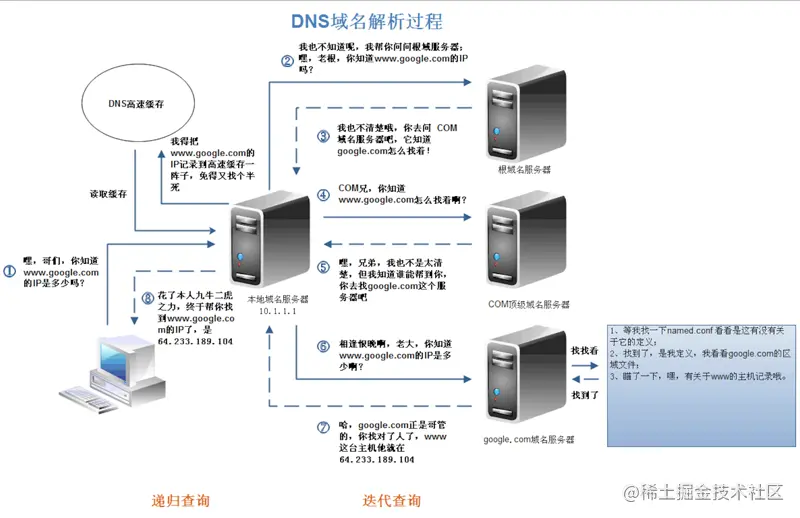

# 从❤浏览器地址栏输⼊url到显示⻚

## 基础版本
- 浏览器根据请求的 **URL 交给 DNS** 域名解析，找到真实 IP ，向服务器发起请求；
- 服务器交给后台处理完成后返回数据，浏览器接收⽂件（ HTML、JS、CSS 、图象等）；
- 浏览器对加载到的资源 <ofont>（ HTML、JS、CSS 等）</ofont>    进⾏语法解析，建⽴相应的内部数据结构（如 HTML 的 DOM ）；
- 载⼊解析到的资源⽂件，渲染⻚⾯，完成。

## 详细版
- 1. 在浏览器地址栏输⼊URL
- 2. **浏览器缓存**，浏览器查看缓存如果请求资源在缓存中并且新鲜，跳转到转码步骤
  - 1. 如果资源未缓存，发起新请求
  - 2. 如果已缓存，检验是否⾜够新鲜，⾜够新鲜直接提供给客户端，否则与服务器进⾏验证。
  - 3. 检验新鲜通常有两个HTTP头进⾏控制 **Expires** 和 **Cache-Control** ：
    - HTTP1.0提供Expires，值为⼀个绝对时间表示缓存新鲜⽇期
    - HTTP1.1增加了Cache-Control: max-age=,值为以秒为单位的最⼤新鲜时间
- 3. 浏览器**解析URL**获取协议，主机，端⼝，path
- 4. 浏览器**组装⼀个HTTP（GET）请求报⽂**
- 5. 浏览器获取主机ip地址，过程如下：**【DNS】 域名解析IP**
  - 1. 浏览器缓存
  - 2. 系统缓存 ：如果浏览器缓存中找不到需要的DNS记录，那就去操作系统中找。
  - 3. **hosts⽂件**
  - 4. 路由器缓存 DNS服务器在名称解析过程中正确的查询顺序
  - 5. ISP的DNS缓存 【ISP是**互联网服务提供商**(Internet Service Provider)的简称】例如中国电信、中国移动的宽带提供商的DNS服务器，
    - ISP DNS服务器，就是**本地连接里面的那个DNS服务器** 
  - 6. 还没有，基本上是国外网站了，这个时候 ISPDNS会从配置文件里面读取**13个根域名服务器**的地址（这些地址是不变的，直接在BIND的配置文件中），然后像其中一台发起请求
  - 7、根服务器拿到这个请求后，知道他是**com.这个顶级域名下的【注意：先解析域名类型】**，所以就会返回com域中的NS记录 （一般来说是13台主机名和IP）。
    - **NS**（Name Server）记录是域名服务器记录，用来指定该域名由哪个DNS服务器来进行解析。基本信息是域名服务器记录。用来表明由哪台服务器对该域名进行解析。”
  - 8、拿到域名类型服务器记录之后，ISPDNS先会向其中一台再次发起请求，com域的服务器发现你这请求是baidu.com这个域的，我一查发现了这个域的NS，那我就返回给你，你再去查。
    - 一般来说 顶级域名不会存在所有的根服务器，所以需要一次查找
  - 9、ISPDNS**不厌其烦的递归**再次向baidu.com这个域的权威服务器发起请求，baidu.com收到之后，查了下有www的这台主机，就把这个IP返回给你了，
  - 10、直到**ISPDNS拿到了之后**，将其返回给了客户端，并且把这个保存在高速缓存中。

- 6. **打开⼀个socket与⽬标IP地址，端⼝建⽴TCP链接**，三次握⼿如下：
  - 1. 客户端发送⼀个TCP的**SYN=1，Seq=X**的包到服务器端⼝
  - 2. 服务器发回**SYN=1， ACK=X+1， Seq=Y**的响应包
  - 3. 客户端发送**ACK=Y+1， Seq=Z**
- 7. TCP链接建⽴后**发送HTTP请求**
- 8. 服务器接受请求并解析，将请求转发到服务程序，如虚拟主机使⽤HTTP Host头部判断请求的服务程序
- 9. 服务器检查**HTTP请求头是否包含缓存验证信息**如果验证缓存新鲜，返回304等对应状态码
- 10. 处理程序读取完整请求并准备HTTP响应，可能需要查询数据库等操作
- 11. 服务器将**响应报⽂通过TCP连接发送回浏览器**
- 12. 浏览器接收HTTP响应，然后根据情况选择**关闭TCP连接或者保留重⽤，关闭TCP连接的四次握⼿如下**：
  - 1. 主动⽅发送**Fin=1， Ack=Z， Seq= X**报⽂
  - 2. 被动⽅发送**ACK=X+1， Seq=Z**报⽂
  - 3. 被动⽅发送**Fin=1， ACK=X， Seq=Y**报⽂
  - 4. 主动⽅发送**ACK=Y， Seq=X**报⽂
- 13. 浏览器检查响应状态吗：是否为1XX，3XX， 4XX， 5XX，这些情况处理与2XX不同
- 14. 如果资源可缓存，**进⾏缓存**
- 15. 对响应进⾏**解码（例如gzip压缩）**
- 16. 根据资源类型决定如何处理（假设资源为HTML⽂档）
- 17. **解析HTML⽂档，构件DOM树，下载资源，构造CSSOM树，执⾏js脚本**，这些操作没有严格的先后顺序，以下分别解释
- 18. **构建DOM树：**
  - 1. Tokenizing：根据HTML规范将字符流解析为标记
  - 2. Lexing：词法分析将标记转换为对象并定义属性和规则
  - 3. DOM construction：根据HTML标记关系将对象组成DOM树
- 19. 解析过程中遇到图⽚、样式表、js⽂件，启动下载
- 20. **构建CSSOM树：**
  - 1. **Tokenizing：**字符流转换为标记流
  - 2. **Node**：根据标记创建节点
  - 3. **CSSOM**：节点创建CSSOM树
- 21. 根据DOM树和CSSOM树**构建渲染树** :
  - 1. 从DOM树的根节点遍历所有<ofont>可⻅节点</ofont> ，不可⻅节点包括：1）<ofont>script , meta</ofont>    这样本身不可⻅的标签。2)被css隐藏的节点，如 <ofont>display: none</ofont>
  - 2. 对每⼀个可⻅节点，找到恰当的CSSOM规则并应⽤
  - 3. 发布可视节点的内容和计算样式
- 布局（Layout）
  - 浏览器根据渲染树所体现的节点、各个节点的CSS定义以及它们的从属关系，计算出每个节点在屏幕中的位置。
  - Web 页面中元素的布局是相对的，在页面元素位置、大小发生变化，往往会导致其他节点联动，需要重新计算布局，这时候的布局过程一般被称为**回流（Reflow）**。
- 绘制（Paint）：
  - 遍历渲染树，调用渲染器的 paint() 方法在屏幕上绘制出节点内容，本质上是一个像素填充的过程。
  - 这个过程也出现于回流或一些不影响布局的 CSS 修改引起的屏幕局部重画，这时候它被称为**重绘（Repaint）**。实际上，绘制过程是在多个层上完成的，这些层我们称为**渲染层（RenderLayer）**。
- **渲染层合成（Composite）**
  - 多个绘制后的渲染层按照恰当的重叠顺序进行合并，而后生成位图，最终通过显卡展示到屏幕上。
- 22. **js解析如下：**
  - 1. 浏览器创建Document对象并解析HTML，将解析到的元素和⽂本节点添加到⽂档中，此时**document.readystate为loading**
  - 2. HTML解析器遇到 <ofont>没有async和defer的script时</ofont> ，将他们添加到⽂档中，然后执⾏⾏内或外部脚本。这些脚本会同步执⾏，并且在脚本下载和执⾏时解析器会暂停。这样就可以⽤document.write()把⽂本插⼊到输⼊流中。同步脚本经常简单定义函数和注册事件处理程序，他们可以遍历和操作**script和他们之前的⽂档内容**
    - 即 html解析同步脚本，会同步执行，JS代码被执行时，渲染引擎会停止工作，即**停止渲染等待JS代码执行完**。这也是为什么script标签要放最后的原因。
  - 3. 当解析器遇到设置了**async**属性的script时，开始下载脚本并继续解析⽂档。脚本会在**它下载完成后尽快执⾏**，但是**解析器不会停下来等它下载**。异步脚本禁⽌使⽤**document.write()**，它们可以访问⾃⼰script和之前的⽂档元素
  - 4. 当⽂档完成解析，document.readState变成interactive
  - 5. 所有**defer**脚本会**按照在⽂档出现的顺序执⾏**，延迟脚本能**访问完整⽂档树**，禁⽌使⽤document.write()
  - 6. 浏览器在**Document对象上触发DOMContentLoaded事件**
  - 7. 此时⽂档完全解析完成，浏览器可能还在等待如图⽚等内容加载，等这些**内容完成载⼊并且所有异步脚本完成载⼊和执⾏**，document.readState变为complete，window触发load事件
- 23. 显示⻚⾯（HTML解析过程中会逐步显示⻚⾯）

## 详细简版
1. 从浏览器接收 **url** 到开启⽹络请求线程（这⼀部分可以展开浏览器的机制以及进程与线程之间的关系）
2. 开启⽹络线程到发出⼀个完整的 HTTP 请求（这⼀部分涉及到 **dns查询，TCP/IP**请求，五层因特⽹协议栈等知识）
3. 从服务器接收到请求到对应后台接收到请求（这⼀部分可能涉及到负载均衡，安全拦截以及后台内部的处理等等）
4. 后台和前台的 **HTTP交互** （这⼀部分包括 HTTP 头部、响应码、报⽂结构、 **cookie** 等知
识，可以提下静态资源的 cookie 优化，以及编码解码，如 **gzip** 压缩等）
5. 单独拎出来的**缓存问题**， HTTP 的缓存（这部分包括http缓存头部， ETag ， catchcontrol 等）
6. 浏览器接收到 **HTTP** 数据包后的解析流程（解析 html -词法分析然后解析成 **dom** 树、解析 **css** ⽣成 **css** 规则树、合并成 **render** 树，然后 **layout 、 painting** 渲染、复合图层的合成、 **GPU** 绘制、外链资源的处理、 **loaded 和 DOMContentLoaded** 等）
7. CSS 的可视化格式模型（元素的渲染规则，如包含块，控制框， **BFC** ， **IFC** 等概念）
8. **JS** 引擎解析过程（ JS 的解释阶段，预处理阶段，执⾏阶段⽣成执⾏上下⽂， **VO** ，作⽤域链、回收机制等等）
9. 其它（可以拓展不同的知识模块，如跨域，web安全， **hybrid** 模式等等内容）
