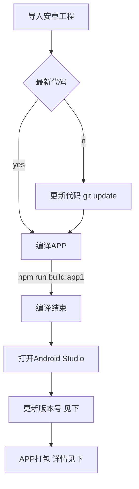
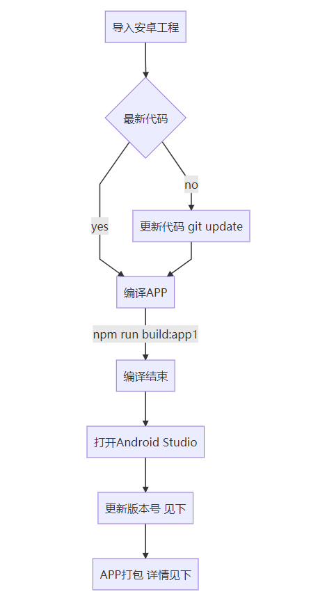
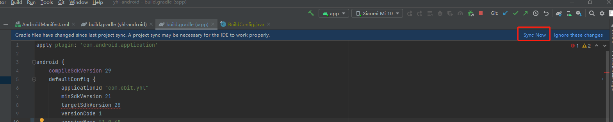
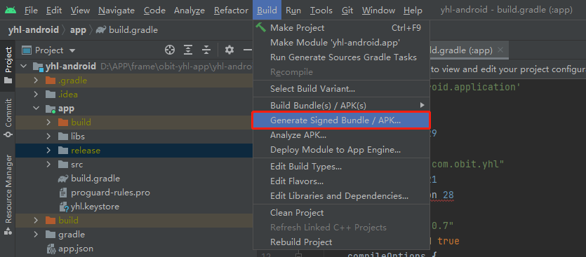
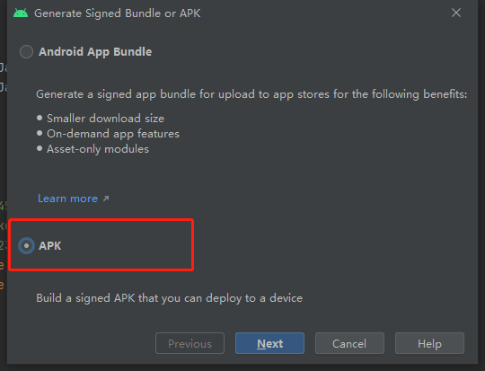
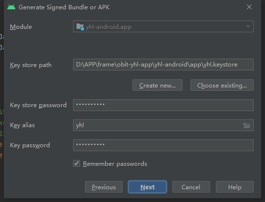
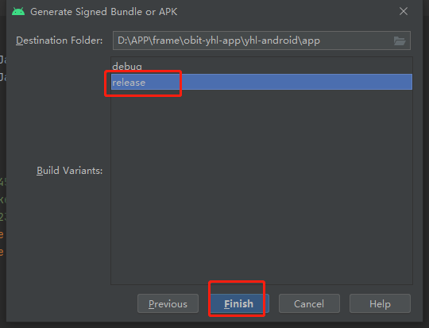

# uniapp 离线打包
## 安卓离线打包

### 离线SDK下载


### 生成APPId 
- uniapp应用，必须先通过Hbuildx 获取新的appId
- <ofont>appId需要修改的点</ofont> 

    - 路径`android/simpleDemo/src/main/assets/data/dcloud_control.xml`
    ```xml
    <hbuilder>
        <apps>
            <app appid="__UNI__5891625" appver=""/>
        </apps>
    </hbuilder>
    ```
### 生成证书
- 使用keytool -genkey命令生成证书：
    ```shell
    keytool -genkey -alias appCer -keyalg RSA -keysize 2048 -validity 36500 -keystore appCer.keystore
    ```

    - appCer 是证书别名，可修改为自己想设置的字符，建议使用英文字母和数字
    - appCer.keystore是证书文件名称，可修改为自己想设置的文件名称，也可以指定完整文件路径
- 按照提示依次输入相关密码和证书信息 最后生成证书
- <ofont>证书信息配置</ofont> 

    - 路径路径`android/simpleDemo/build.gradle`配置文件 `signingConfigs` 
    ```gradle
    android {
        compileSdkVersion 29
    }
    signingConfigs {
        config {
            keyAlias 'appCer'
            keyPassword 'xxx'
            storeFile file('appCer.keystore')
            storePassword 'xxx'
            v1SigningEnabled true
            v2SigningEnabled true
        }
    }
    ```

### 查看证书信息
- 可以使用以下命令查看：
```shell
keytool -list -v -keystore appCer.keystore  
```
- Enter keystore password: //输入密码，回车

### 定义安卓包名
- <ofont>包名需要修改的点</ofont> 

    - 1、路径`android/simpleDemo/build.gradle`配置文件 `applicationId` 
    ```gradle
    android {
        compileSdkVersion 29
        defaultConfig {
            applicationId "com.obit.waterai"
            minSdkVersion 21
            targetSdkVersion 28
            versionCode 1
            versionName "1.0.1"
            multiDexEnabled true
            compileOptions {
                sourceCompatibility JavaVersion.VERSION_1_8
                targetCompatibility JavaVersion.VERSION_1_8
            }
        }
    }
    ```
    - 2、路径`android/simpleDemo/src/main/AndroidManifest.xml`配置文件  
        - package 
        - android:authorities
        ```
       <manifest xmlns:android="http://schemas.android.com/apk/res/android"
        package="com.test.demo">
        <application>
        <provider
            android:name="io.dcloud.common.util.DCloud_FileProvider"
            android:authorities="com.test.demo.dc.fileprovider"
            android:exported="false"
            android:grantUriPermissions="true">
            <meta-data
                android:name="android.support.FILE_PROVIDER_PATHS"
                android:resource="@xml/dcloud_file_provider" />
        </provider>
        </application>
        </manifest>
        ``` 


### 离线打包Key
- 前往**dcloud**[开发者后台](https://dev.dcloud.net.cn/app)，生成离线打包Key
- 需要信息
    - Android包名
    - Android 证书签名SHA1 详情见[查看证书信息](#查看证书信息)
    - 保存即可 生成 **APPkey**

-  <ofont>appkey 配置位置</ofont> 

    - 路径`android/simpleDemo/src/main/AndroidManifest.xml`配置文件  
    - 注意：android:name为 `dcloud_appkey`无需改动，将Appkey填入  `android:value`即可

    ```
       <manifest xmlns:android="http://schemas.android.com/apk/res/android"
        package="com.test.demo">
        <application>
        <meta-data
            android:name="dcloud_appkey"
            android:value="xxxxxxxxxxxxxxxxxxxxxxxxxx" />
        </application>
        </manifest>
        ``` 
### 修改APP Name

- <ofont>修改APP Name</ofont> 

    - 路径`android/simpleDemo/src/main/res/values/strings.xml`
    ```xml
    <resources>
        <string name="app_name">XX APP</string>
    </resources>
    ```


# 打包升级

## 安装IDE  Android Studio

## APP介绍

### 1、目录结构

APP工程主体为uniapp工程，离线打包需要安卓原生工程，目前 **安卓原生工程目录如下**

- obit-yhl-app
  - src
  - **yhl-android**  ``安卓工程目录``
    - app
      - **appCer.keystore**  重要 **APP秘钥** 打包需要  **下面APP打包需要**
  - index.html
  - package.json

  

  

  

  

  

###   2、导入安卓工程 

通过 IDE 导入安卓工程 ，引入目录为 ``安卓工程目录``，详情见上面目录介绍

## 打包流程



## 更新版本号

- 1、修改app/build.gradle文件 ``位置如下``

  - ```gradle
    android {
        defaultConfig {
            versionName "1.0.3"
        }
    }
    ```

- 2、执行Sync Now 重新编译



## APP打包

- Build
  - 选择 Generate Signed Bundle or APK，效果如下图
  - 
  -    
  - 选择 APK 点击 Next
  - 
  - 选择Key Store Path  目录结构里面的   **APP秘钥**
  - 填入 Key Store password 
  - 填入key alias    
    - **yhl**
  - 填入 Key password 
  - 全部输入完毕  Next
  - 
  - 选择  release ，点击  Finish 开始打包 
  - 等待打包结束
  - 打包结束 APK文件在最后一步的 Destination Folder对应的目录下的 **release文件夹下面**