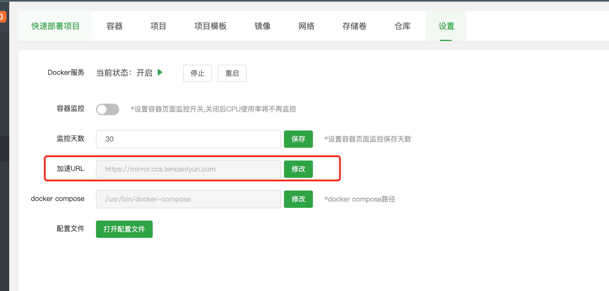
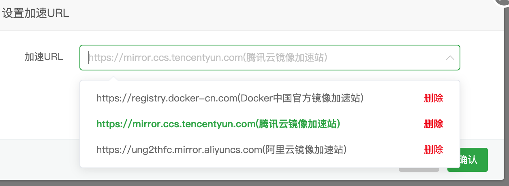

# Docker

## 配置镜像加速

### 阿里云镜像服务加速

[阿里云镜像加速](https://cr.con sole.aliyun.com/cn-hangzhou/instances/mirrors)


**CentOS 配置**
1. 安装／升级Docker客户端
推荐安装1.10.0以上版本的Docker客户端，参考文档docker-ce

2. 配置镜像加速器
针对Docker客户端版本大于 1.10.0 的用户

您可以通过修改daemon配置文件/etc/docker/daemon.json来使用加速器

```shell
sudo mkdir -p /etc/docker
sudo tee /etc/docker/daemon.json <<-'EOF'
{
  "registry-mirrors": ["https://xxxxx.mirror.aliyuncs.com"]
}
EOF
sudo systemctl daemon-reload
sudo systemctl restart docker
```


命令解释
这个命令使用 `tee` 将一段 JSON 内容写入 `/etc/docker/daemon.json` 文件。让我们逐步解析这个命令：

1. `tee /etc/docker/daemon.json`：`tee` 命令将标准输入（stdin）复制到标准输出（stdout）和指定的文件（在这里是 `/etc/docker/daemon.json`）。

2. `<<-'EOF'`：这是一个叫做 "here-document" 的结构，用于将多行文本传递给 `tee` 命令。`EOF` 是一个分界符，用于标识多行文本的开始和结束。在这里，我们使用了 `-` 符号，它告诉 shell 删除多行文本开头的制表符（tab）。这样，我们可以在多行文本中使用缩进，使代码更易读。

3. `{ "registry-mirrors": ["m"] }`：要保存的内容

4. `EOF`：这是 here-document 结构的结束分界符。

这个命令的作用是将 JSON 对象 `{ "registry-mirrors": ["m"] }` 写入 `/etc/docker/daemon.json` 文件。 

### 宝塔
利用宝塔安装 docker

在设置中可以选择docker加速服务




## 命令解读
