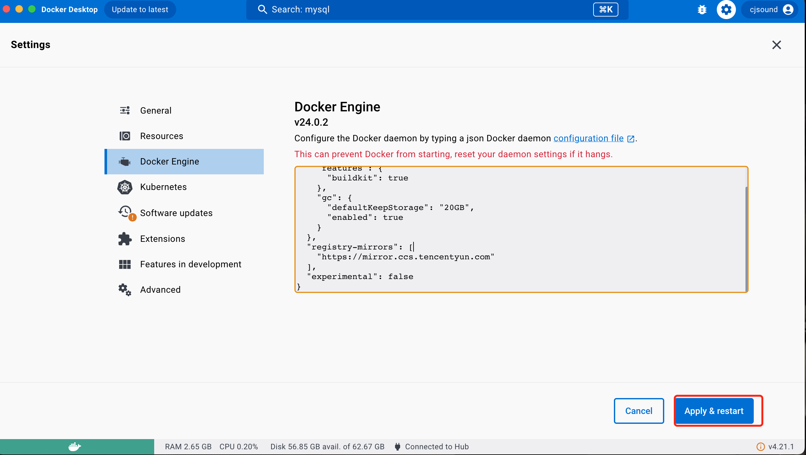

# Docker

## 配置镜像加速

### 阿里云镜像服务加速

[阿里云镜像加速](https://cr.con sole.aliyun.com/cn-hangzhou/instances/mirrors)

**CentOS 配置**

1. 安装／升级 Docker 客户端
   推荐安装 1.10.0 以上版本的 Docker 客户端，参考文档 docker-ce

2. 配置镜像加速器
   针对 Docker 客户端版本大于 1.10.0 的用户

您可以通过修改 daemon 配置文件/etc/docker/daemon.json 来使用加速器

```shell
sudo mkdir -p /etc/docker
sudo tee /etc/docker/daemon.json <<-'EOF'
{
  "registry-mirrors": ["https://xxxxx.mirror.aliyuncs.com"]
}
EOF
sudo systemctl daemon-reload
sudo systemctl restart docker
```

命令解释
这个命令使用 `tee` 将一段 JSON 内容写入 `/etc/docker/daemon.json` 文件。让我们逐步解析这个命令：

1. `tee /etc/docker/daemon.json`：`tee` 命令将标准输入（stdin）复制到标准输出（stdout）和指定的文件（在这里是 `/etc/docker/daemon.json`）。

2. `<<-'EOF'`：这是一个叫做 "here-document" 的结构，用于将多行文本传递给 `tee` 命令。`EOF` 是一个分界符，用于标识多行文本的开始和结束。在这里，我们使用了 `-` 符号，它告诉 shell 删除多行文本开头的制表符（tab）。这样，我们可以在多行文本中使用缩进，使代码更易读。

3. `{ "registry-mirrors": ["m"] }`：要保存的内容

4. `EOF`：这是 here-document 结构的结束分界符。

这个命令的作用是将 JSON 对象 `{ "registry-mirrors": ["m"] }` 写入 `/etc/docker/daemon.json` 文件。

**MacOs 配置**



### 宝塔

利用宝塔安装 docker

在设置中可以选择 docker 加速服务


## 示例：安装 mysql

```shell
docker run -d \
    --name mysql \
    -p 3306:3306 \
    -e TZ="Asia/Shanghai" \
    -e MYSQL_ROOT_PASSWORD=manager1 \
    mysql
```


## 示例：安装 Nginx

```shell
# 拉取最新的Nginx镜像
docker pull nginx

# 创建容器并运行
docker run  -d --name nginx -p 80:80 -v ng1Html:/usr/share/nginx/html nginx

# 停止Nginx容器
docker stop nginx

# 重启Nginx 容器
docker start nginx


```

**-v ng1Html:/usr/share/nginx/html**：将宿主机上的 ng1Html 目录挂载到容器内的 /usr/share/nginx/html 目录。

这意味着容器内的 Nginx 服务器将使用宿主机上的 `ng1Html` 目录作为网站的根目录。

## 命令解读

:::tip
docker 常用命令
:::
[Docker Hub](https://hub.docker.com/)是 Docker 提供的官方的镜像仓库，可以查询所有的官方镜像和环境变量设置等信息

[Docker 命令大全官方文档](https://docs.docker.com/reference/)，


**以下是一些常用命令**

### docker run

创建并运行一个隔离容器，每次执行会**重新创建一个新的容器**

**-d** 是让容器在后台运行

- --name mysql :给容器命名为 mysql
- -p 3306:3306 容器端口和宿主机端口映射，**前为宿主机，后为容器内**
- **-e env 的缩写** KEY=VALUE ，设置环境变量，根据镜像决定支持 MYSQL_ROOT_PASSWORD=password :设置 mysql 的 root 用户密码
- -e TZ :设置容器时区为上海
- mysql: 最后为 镜像名，完整格式为 mysql:版本号，如果不指定版本，默认会从 Docker Hub 下载 mysql 最新的版本

### docker pull

拉取远端镜像到本地

### docker images

查看本地所有镜像

### docker rmi

`【rm image】` 删除本地的镜像

### docker save

将本地镜像导出为 tar 包

```shell
docker save -o nginx.tar nginx:latest
```

例如将 nginx 镜像保存到 nginx.tar

### docker load

导入镜像

```shell
docker load -i nginx.tar
```

导入之前 save 的镜像 tar 包

### docker stop

停止容器，停止后容器会进入停止状态，容器还在，可以通过 docker start 启动

### docker start

容器内部已经停止状态的容器，可以通过 docker start 启动

### docker ps 查看容器运行状态

列出当前正在运行的 Docker 容器
以下是 docker ps 命令的基本语法：

docker ps [options]
其中，options 是可选的参数，用于自定义输出。

以下是一些常用的 docker ps 选项：

- a：显示所有容器（包括已停止的容器）。
- f：使用过滤器来限制显示的容器。
- -format：指定输出格式。
- n：显示最近创建的 n 个容器。
- q：仅显示容器 ID。
- s：显示容器的大小。

### docker rm

删除容器

### docker logs

查看容器日志

```shell
docker logs [options] CONTAINER
```

其中，options 是可选的参数，用于自定义输出，CONTAINER 是要查看日志的容器名称或容器 ID。

以下是一些常用的 docker logs 选项：

- -f 或 --follow：以实时跟踪模式查看日志输出。
- --tail：仅显示最后 n 行日志。
- --since：仅显示自指定时间以来的日志。
- --until：仅显示直到指定时间的日志。
- -t 或 --timestamps：在日志输出中包含时间戳。

例如： 查看 Nginx 的日志

```shell
docker logs -f nginx
```

一般会增加-f 打印最新的日志

### docker exec

进入运行中的容器内部，执行命令

以下是一些常用的 docker exec 选项：

- -d 或 --detach：在后台运行命令，并返回容器 ID。
- -i 或 --interactive：以交互模式运行命令。
- -t 或 --tty：为命令分配一个伪终端。
- -u 或 --user：以指定的用户身份运行命令。
- -w 或 --workdir：设置命令的工作目录。

以下是一个使用 `docker exec` 命令的示例：

```shell
docker exec -it nginx bash
```

这将在名为 `nginx` 的容器内启动一个交互式的 Bash shell。**-it** 选项表示以交互模式运行命令，并为命令分配一个伪终端。

在容器内的 Bash shell 中，您可以执行任何命令，就像在普通的 Linux 系统中一样。要退出容器内的 Bash shell，请输入 **exit** 或按 **Ctrl + D**。

### 命令图解


### 镜像环境变量

环境变量根据镜像开发者决定支持的环境变量，可以通过 docker inspect 查看

Docker 镜像官网：[HubDocker](https://hub.docker.com/)

例如 设置[Mysql](https://hub.docker.com/_/mysql)的 root 密码 `MYSQL_ROOT_PASSWORD`


### Docker build 构建镜像

利用Dockerfile 构建镜像


命令执行工作空间默认下有Dockerfile文件

```shell
# 注意：默认生成的镜像平台是arm，注意区分服务器平台
# 下面是生成amd64 平台的镜像
docker build --platform linux/amd64 -t   mall-admin_amd64 .
# 下面是生成arm64 平台的镜像
docker build  -t   mall-admin_arm64 .
```

在当前路径下 根据 dockerFile 构建镜像 ，构建的镜像名为 xxxx:version

**单个镜像构建脚本**

```sh
#!/bin/bash
local_file="./mall-admin_amd64.tar"
remote_user="root"
remote_host="xxx"
remote_path="/www/wwwroot/images"
docker build --platform linux/amd64 -t   mall-admin_amd64 .
docker save -o mall-admin_amd64.tar mall-admin_amd64
scp "$local_file" "${remote_user}@${remote_host}:${remote_path}"

```

- 构建 amd64 镜像
- 将镜像导出为 tar 包
- 将 tar 包上传到服务器
- 在服务器上 load 镜像
  - docker load -i 导入的镜像包

### 命令别名

命令的别名是指在命令行中为一个命令指定一个简短的别名，以便更快地输入和执行该命令。在 Linux 和 Unix 系统中，您可以使用 `alias` 命令来创建命令别名。

```shell
# vi打开root路径下的 shell 配置文件 .bashrc ，全局生效
vi ~/.bashrc

# 添加命令别名
alias di='docker images'

# 保存修改
:wq

# 使修改生效
source ~/.bashrc
```

## 数据卷


|命令|说明|文档地址|
|--|--|--|
|docker volume create| 创建数据卷||
|docker volume ls| 查看所有数据卷||
|docker volume rm| 删除指定数据卷||
|docker volume inspect| 查看某个数据卷的详情||
|docker volume prune| 清楚数据卷||
